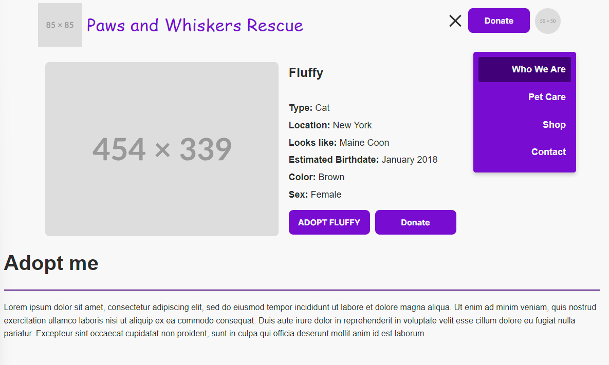
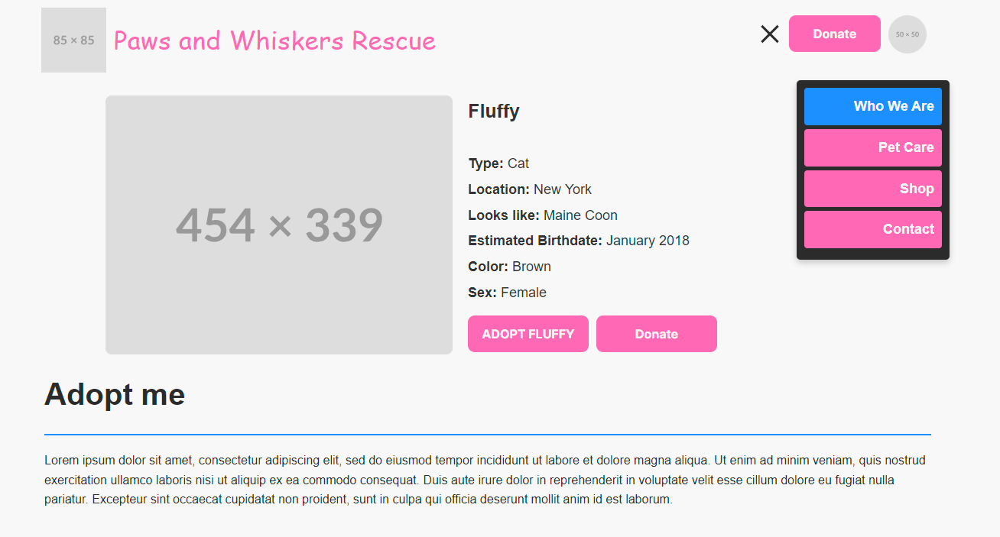

# proposal-profile

## Wireframe

## Color Palette

### Set 1

| Color Name           | Color Sample                                                                                     | Hex Code  |
|----------------------|--------------------------------------------------------------------------------------------------|-----------|
| **Primary Color**   |  French Violet                       | `#780BD1` |
| **Secondary Color**     |  Indigo                             | `#410078` |
| **Page Background**   |  Light Grayish White               | `#F8F8F8` |
| **Text Color**        |  Dark Charcoal                     | `#2C2C2C` |

---

### Set 2

| Color Name           | Color Sample                                                                                     | Hex Code  |
|----------------------|--------------------------------------------------------------------------------------------------|-----------|
| **Primary Color**     |  Hot Pink                          | `#FF69B4` |
| **Secondary Color**   |  Dodger Blue                       | `#1E90FF` |
| **Page Background**   |  Light Grayish White               | `#F8F8F8` |
| **Text Color**        |  Deep Charcoal                     | `#2B2B2B` |

---

