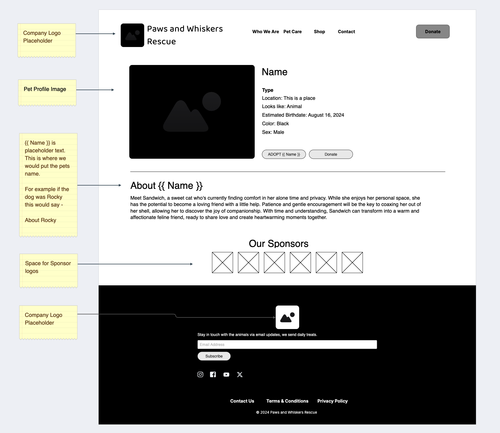
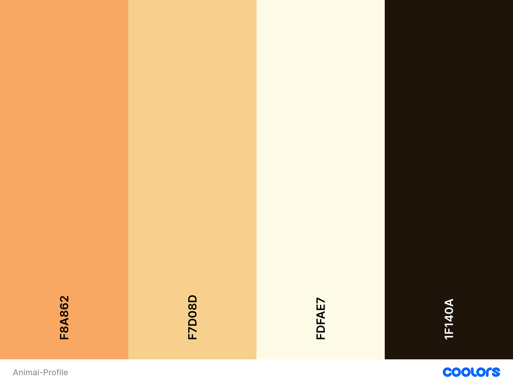

# proposal-profile

## Wireframe

## Color Palette

| Color Name           | Color Sample                                                                                     | Hex Code  |
|----------------------|--------------------------------------------------------------------------------------------------|-----------|
| **Primary Color**     |  Sandy Brown                       | `#F8A862` |
| **Secondary Color**   |  Sunset                             | `#F7D08D` |
| **Page Background**   |  Ivory                               | `#FDFAE7` |
| **Text Color**        |  Licorice                            | `#1F140A` |

